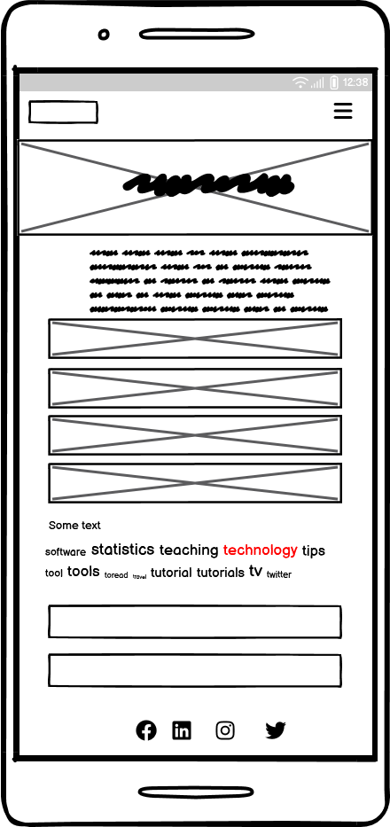

# Unwind Your Mind

Welcome to **Unwind Your Mind**!

## Purpose

The purpose of this website is to provide users with a variety of tools and resources to help them relax, de-stress, and improve their mental well-being. Whether you're looking for guided meditations, relaxation techniques, or tips for managing stress, Unwind Your Mind has something for everyone.

"Unwind Your Mind" has been developed as part of Code Institute's Full-Stack Software Development Bootcamp as my 1st ever project. This project is made by using HTML, CSS and Bootstrap.

## Featured Image


This image represents the essence of relaxation and tranquility that "Unwind Your Mind" aims to provide. The website is designed to be fully responsive, ensuring a seamless experience across all devices.

## User Experience (UX Design)

### User Stories

- As a user, I want to easily navigate the website so that I can find the resources I need without any hassle.
- As a user, I want to access tips so that I can practice mindfulness and relaxation techniques.
- As a user, I want to read articles on stress management or any success story so that I can learn new ways to cope with stress.
- As a user, I want the website to be visually appealing so that I feel calm and relaxed while using it.
- As a user, I want the website to be responsive so that I can access it on any device.

### Client Goals

- Provide a comprehensive resource for users to improve their mental well-being.
- Ensure the website is user-friendly and easy to navigate.
- Create a visually appealing design that promotes relaxation and tranquility.
- Offer a variety of content, including guided meditations, articles, and relaxation techniques.
- Ensure the website is fully responsive and accessible on all devices.

### User Goals

- Find and access tips, sessions quickly and easily.
- Learn new techniques for managing stress and improving mental well-being.
- Enjoy a seamless and visually pleasing experience across all devices.
- Feel relaxed and calm while using the website.
- Access a variety of resources that cater to different aspects of mental health.

## Design

### Colour Scheme

The colour scheme for "Unwind Your Mind" has been carefully selected to promote a sense of calm and relaxation. 


### Typography

The typography for "Unwind Your Mind" has been chosen to enhance readability and promote a sense of calm. The heading font used is **Outfit**, and the body font is **Funnel Sans**.


### Wireframes

Wireframes are used in the design process to create a visual guide that represents the skeletal framework of the website. They help in planning the layout and structure of the website, ensuring that all elements are placed logically and efficiently. Wireframes are essential for identifying potential usability issues early in the design process and for communicating the design vision to stakeholders.

Below are my wireframes design of home page for different screen sizes:


#### Laptop

The wireframe for the laptop version of the homepage is designed to provide a comprehensive view of the website's features and content. It includes a navigation bar at the top, a large hero image, and sections for sessions, tips and support. 


#### Tablet

The wireframe for the tablet version of the homepage is designed to provide an optimal viewing experience on medium-sized screens. It includes a simplified navigation bar, a prominent hero image, and well-organized sections for featured sessions, tips and support. 


#### Mobile

The wireframe for the mobile version of the homepage is designed to provide a seamless experience on small screens. It includes a collapsible navigation menu, a prominent hero image, and vertically stacked sections for featured sessions, tips, and support.




**This was my initial sketch for the layout. During the design process, I made some minor adjustments without changing the overall design layout.**

## Technologies Used

### Languages Used

- HTML
- CSS

### Frameworks, Libraries and Programs Used

- **Bootstrap 5.3**: Used for responsive design and styling.
- **Google Fonts**: Used to import the 'Outfit' and 'Funnel Sans' fonts.
- **Font Awesome**: Used for icons to enhance the visual appeal.
- **Git**: Used for version control.
- **GitHub**: Used to host the repository and deploy the website.
- **Balsamiq**: Used for creating wireframes.
- **Google DevTools**: Used for debugging and testing the website.
- **Am I Responsive**: Used to test the responsiveness of the website across different devices.
- **Unsplash**: Used for sourcing high-quality, royalty-free images to enhance the visual appeal of the website.
- **Google Images**: Used for finding images and inspiration for the website's design.
- **Snipping Tool**: Used for capturing screenshots during the development process.
- **Chat GPT**: Used for creating user stories
- **Copilot**: Used in some coding

A great tip for this section is to include them as you use them, that way you won't forget what you ended up using when you get to the end of your project.

## Deployment & Local Development

### Deployment

1. Ensure all changes are committed and pushed to the GitHub repository.
2. Navigate to the repository on GitHub.
3. Go to the "Settings" tab.
4. Scroll down to the "Pages" section.
5. Under "Source," select the branch you want to deploy from (usually `main`).
6. Click "Save" and wait for GitHub Pages to build and deploy your site.
7. Once the deployment is complete, you will see a URL where your site is live.

### Local Development

1. Clone the repository to your local machine using `git clone <repository-url>`.
2. Navigate to the project directory using `cd Unwind-Your-Mind`.
3. Open the project in your preferred code editor.
4. Use a local server to view the project. You can use the Live Server extension in VSCode or run a simple HTTP server using Python:
    ```bash
    python -m http.server
    ```
5. Open your browser and go to `http://localhost:8000` to view the project locally.
6. Make changes to the code and see the updates in real-time.
7. Commit and push changes to the repository as needed.

## Testing

 I have conducted manual testing and Lighthouse testing for each page at various screen sizes to ensure optimal performance and error-free operation.

### Lighthouse Testing
#### Desktop


#### Mobile


### Validators

This code has been validated through HTML and CSS validators, and necessary changes have been made accordingly.
 
#### CSS Validator


#### HTML Validator
#### Home Page


#### Tips Page


#### Issues Page


#### Contact Page


## Credits


